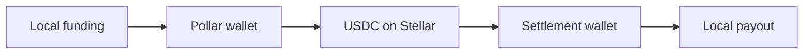

# Rivo

### Local money in. USDC across Stellar. Local money out.

Rivo is a two-way payment experience connecting Bolivia with African bank and mobile-money rails. A sender pays in BOB, NGN, GHS, KES or ZAR; Pollar provides the embedded Stellar wallet; USDC settles between wallets on Stellar; and the recipient completes the journey through a familiar local payout rail.

Built for the **Pollar Hackathon: Build on Pollar** flagship Africa–Latin America corridor challenge.

## Why Rivo

Africa and Latin America have strong local payment systems but few direct connections between them. A cross-border transfer commonly means several intermediaries, unclear pricing and a user experience designed around financial infrastructure rather than people.

Rivo turns that fragmented route into one understandable flow:

- choose a direction;
- enter local recipient details;
- review the complete route and estimated cost;
- settle USDC through a Pollar wallet on Stellar;
- verify the transaction independently;
- complete the destination payout.

The blockchain remains settlement infrastructure, not the product interface.

## Corridor coverage

| Market | Currency | Local rail |
| --- | --- | --- |
| Bolivia | BOB | Bank transfer / Pollar ramp handoff |
| Nigeria | NGN | Bank transfer |
| Ghana | GHS | Mobile money |
| Kenya | KES | M-Pesa / mobile money |
| South Africa | ZAR | Bank transfer |

Every supported African route can operate in both directions with Bolivia.

## How it works



1. **Local funding** — the sender chooses Bolivia or an African market and confirms the corresponding funding handoff.
2. **Pollar wallet** — Pollar authenticates the user and provides the embedded Stellar wallet, asset controls, balances and transaction signing.
3. **USDC settlement** — Rivo calculates the settlement amount and submits a real USDC payment on Stellar testnet through Pollar.
4. **Local payout** — the recipient’s selected bank or mobile-money rail completes the destination side of the route.
5. **Independent proof** — Rivo records the resulting transaction hash at `/proof` and links directly to Stellar Explorer.

## What is working

- Pollar authentication and embedded wallet onboarding
- Stellar wallet creation and address management
- USDC balance display and refresh
- Send, receive, asset and transaction-history controls
- Two-way Bolivia ↔ Africa route selection
- Destination-specific bank and mobile-money forms
- Clear quote, fee, review and confirmation screens
- Real Pollar-signed USDC transactions on Stellar testnet
- Transaction receipt with a Stellar Explorer link
- Persistent in-browser settlement proof ledger
- Responsive desktop and mobile experience
- Production build, TypeScript and ESLint validation

## Proof, not promises

Rivo separates the demonstrable on-chain settlement from the hackathon’s local-rail simulations.

| Stage | Implementation | Verification |
| --- | --- | --- |
| Local source funding | Documented sandbox handoff | Rivo reference and confirmed state |
| Wallet and signing | Live Pollar SDK | Pollar wallet and transaction interface |
| USDC settlement | Real Stellar testnet transaction | Transaction hash and Stellar Explorer |
| Destination payout | Documented sandbox handoff | Recipient, rail and completed state |

The `/proof` route records completed settlements with their direction, source and destination amounts, USDC amount, timestamp, network and complete Explorer link.

Rivo does **not** claim that the sandbox fiat handoffs move production money. It does not represent estimated rates as guaranteed live quotes. The real component is clearly identified: a USDC transaction signed through Pollar and confirmed on Stellar testnet.

## Pollar integration

Rivo uses `@pollar/react` as product infrastructure rather than a decorative integration.

- `PollarProvider` configures the application for Stellar testnet.
- Pollar login creates and restores the user’s embedded wallet.
- `usePollar` provides authentication, wallet state and balances.
- Pollar modals expose receive, assets, wallet balance and transaction history.
- `sendPayment` builds, signs and submits the USDC settlement.
- The resulting transaction state drives Rivo’s settlement and receipt screens.

Users are not asked to manage a seed phrase or manually construct a blockchain transaction.

## Technology

- Next.js 16
- React 19
- TypeScript
- `@pollar/react` 0.11.3
- Stellar testnet
- Circle testnet USDC
- Custom responsive interface

## Run locally

### Requirements

- Node.js 20 or newer
- npm
- A Pollar `pub_testnet_` API key
- A second funded Stellar testnet wallet for settlement

### 1. Install

```bash
npm install
```

### 2. Configure Pollar

```bash
node scripts/setup-key.cjs "$PWD"
```

Enter the Pollar publishable testnet key when prompted.

### 3. Configure the settlement wallet

```bash
node scripts/setup-settlement.cjs "$PWD"
```

Enter the destination Stellar testnet wallet address. The destination wallet must have a trustline for Circle testnet USDC.

### 4. Start Rivo

```bash
npm run dev
```

Open [http://localhost:3000](http://localhost:3000).

## Testnet USDC

Rivo uses Circle testnet USDC on Stellar:

```text
Asset: USDC
Issuer: GBBD47IF6LWK7P7MDEVSCWR7DPUWV3NY3DTQEVFL4NAT4AQH3ZLLFLA5
Network: Stellar testnet
```

XLM is used only for Stellar account reserves and network requirements. It is not the corridor settlement asset.

## Demonstration path

1. Create or restore a wallet through Pollar.
2. Add the configured testnet USDC asset if it is not already enabled.
3. Fund the sending wallet with testnet USDC.
4. Create the lightweight local Rivo profile.
5. Choose Bolivia → Africa or Africa → Bolivia.
6. Select a destination market and local payout rail.
7. Enter the recipient details and review the quote.
8. Confirm the local funding handoff.
9. Approve the pre-addressed USDC settlement through Pollar.
10. Complete the sandbox destination payout.
11. Open the receipt and verify the transaction on Stellar Explorer.
12. Visit `/proof` to inspect the complete recorded settlement.

For judging, demonstrate at least one **BOB → NGN** transaction and one **NGN → BOB** transaction.

## Product principles

- **Local first** — users think in their own currency and payout method.
- **Infrastructure stays quiet** — Stellar and USDC solve settlement without dominating the interface.
- **No ambiguous status** — every stage explains whether it is pending, confirmed, verified or sandboxed.
- **Proof is part of the product** — a completed transaction can be independently inspected.
- **Honest boundaries** — simulated rails are labelled and never presented as production transfers.

## Privacy and configuration

- The user’s Rivo display name and proof ledger are stored in the browser.
- Pollar handles wallet authentication and signing.
- API keys and settlement configuration are stored in `.env.local`.
- `.env.local` is excluded from the repository.
- No private key or seed phrase is stored by Rivo.

## Validation

```bash
npm run lint
npm run build
```

Both commands must pass before deployment.

## Hackathon demo statement

> Rivo connects Bolivia and Africa through a consumer-grade, two-way payment experience. Users fund and receive through familiar local rails, while Pollar wallets and USDC on Stellar provide the settlement layer. In this hackathon build, Pollar wallet operations and USDC settlement are real on Stellar testnet; local funding and payout are transparently documented sandbox handoffs.

---

**Rivo** — Money moves closer.
